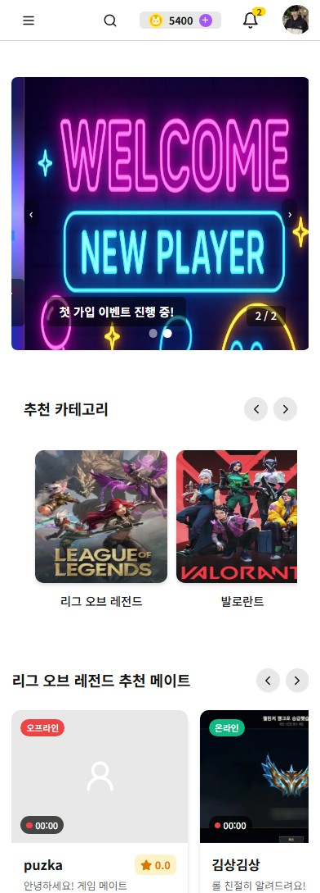
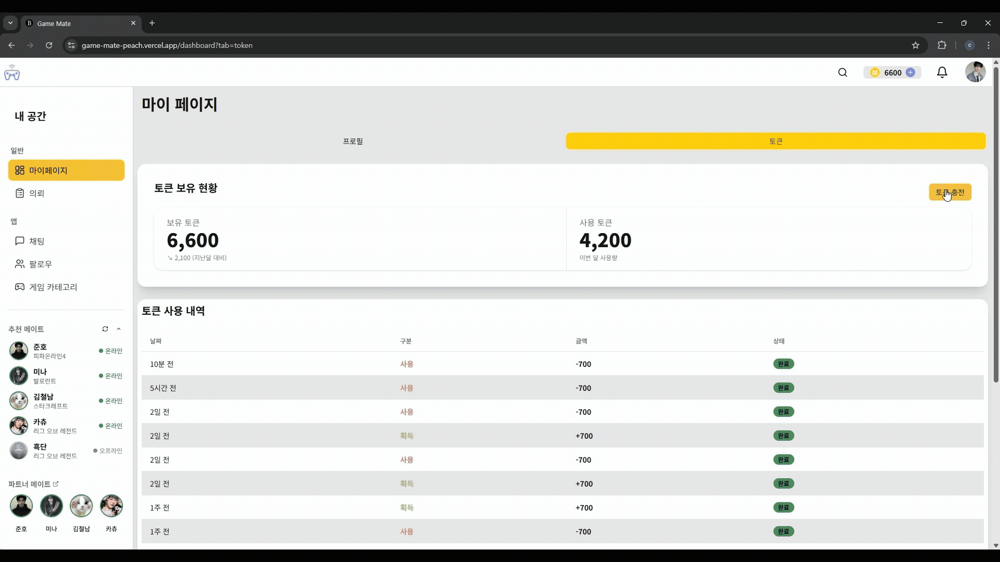
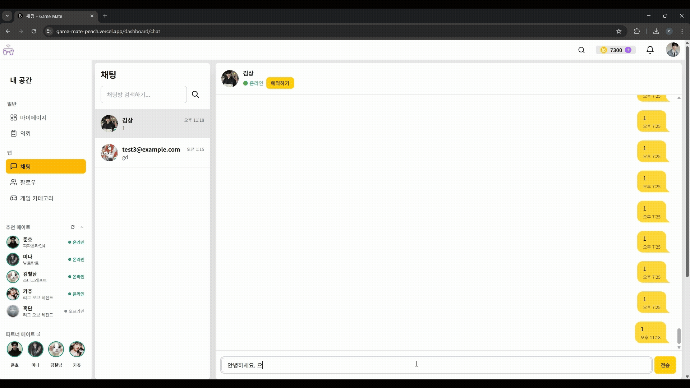
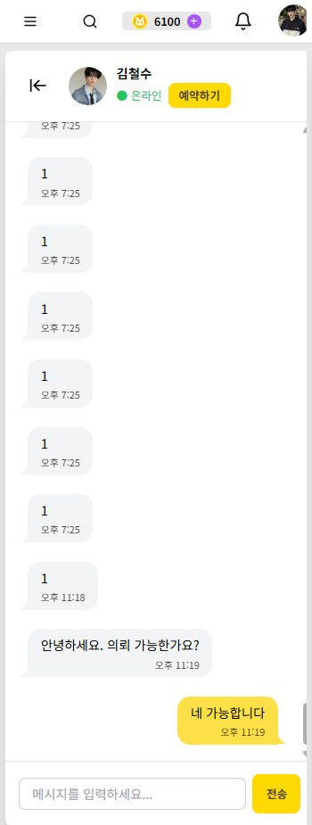
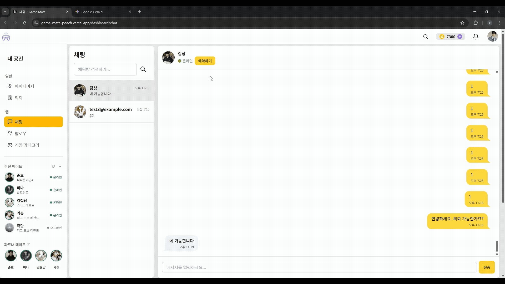
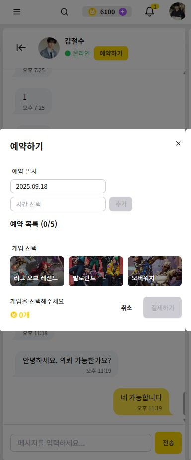
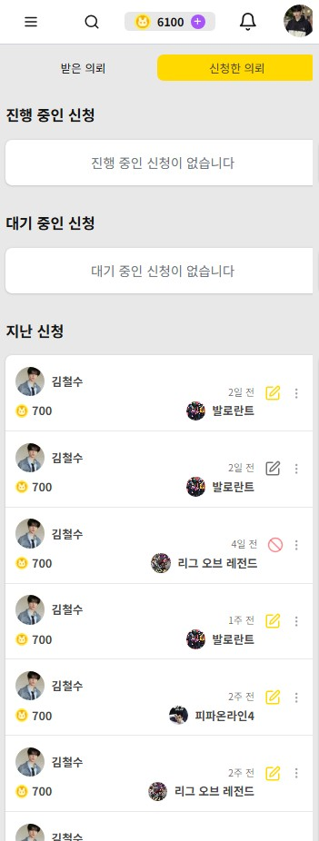
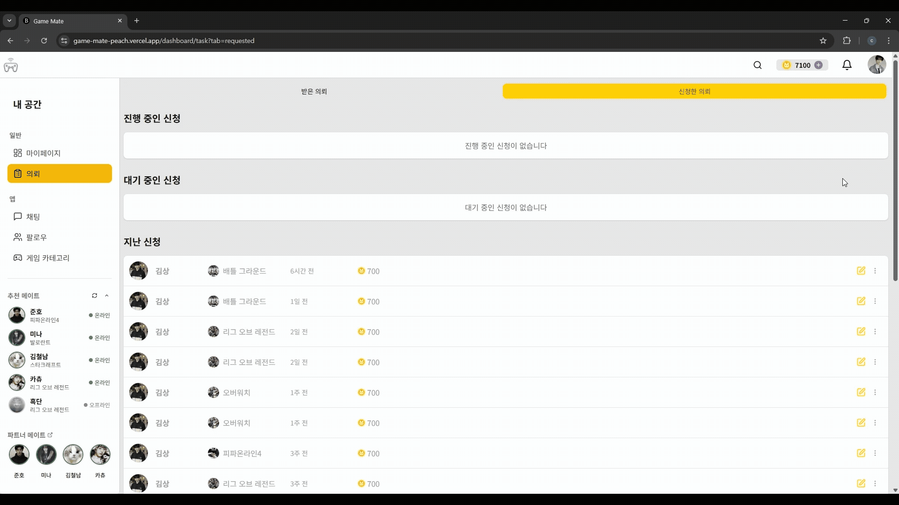

  

<h1 align="center">게임 메이트</h1>

당신이 원하는 플레이어와 함께 짜릿한 승리를 만들어보세요! 
“게임 메이트”는 다채로운 성향의 게이머님들을 위한 게이머 매칭 플랫폼 입니다.

  

## 🎮 Project Introduction

당신이 원하는 플레이어와 함께 짜릿한 승리를 만들어보세요! “게임 메이트”는 다채로운 성향의 게이머님들을 위한 메이트가 준비되어 있답니다!

  <a href="http://localhost:3000" target="_blank">🎮 게임 메이트 서비스 바로가기</a>
   

## 👨‍💻 Developers

|                                            FE                                             |
| :---------------------------------------------------------------------------------------: |
|  |
|                         [@marte113](https://github.com/marte113)                          |

## 🧰 Tech Stacks

- Node v.22.13.8
- React v.19.1.10
- 언어/프레임워크: `typescript` `nextjs@15_app_router`
- UI 라이브러리/프레임워크: `tailwind` `daisyUI`
- 상태 관리 라이브러리: `zustand` `tanstack@react-query`
- 테스트 도구: `vitest`
- 데이터 검증: `zod`
- 패키지 매니저: `npm`
- DB: `supabase`
- 배포: `vercel`

## 🏗️ Architecture

프로덕션 규칙: Next.js 15 App Router, React 19, TypeScript(strict) 기반. Server Component 우선, 상호작용이 필요한 경우에만 Client로 전환합니다.

- 📁 `app/`
  - 앱 라우팅 루트. App Router 기반 페이지 구성. 섹션별 Server Component 우선, 컨테이너/프리패치 패턴 사용.
  - 예) `app/(home)/`, `app/category/`, `app/api/`(Next API Routes)

- 📁 `components/`
  - 앱 전역 재사용 컴포넌트. UI 원자/분자, 공통 Boundary/Feedback 등 포함.

- 📁 `hooks/`
  - React 훅. 도메인 훅과 UI 훅을 구분 유지. React Query 훅은 서비스/레포지토리 레이어 위에서 데이터 접근.

- 📁 `app/apis/`
  - API 레이어. base → repository → service → hooks 흐름 유지. 입력 검증은 Zod, 에러는 함수형 표준 처리.

- 📁 `libs/`
  - 공용 라이브러리(에러/페이징/SEO/스키마 등). 서버-클라이언트 공유 가능한 유틸을 모듈화.

- 📁 `stores/`
  - 전역 상태(Zustand). UI/도메인 스토어 분리, 서버 비밀 값은 클라이언트 노출 금지.

- 📁 `supabase/`
  - Supabase 클라이언트(server/client)와 설정.

- 📁 `constants/`
  - 쿼리 키, 이미지 상수 등 전역 상수.

- 📁 `types/`
  - DB/도메인 타입 정의. API 응답 타입과 UI 모델을 분리해 사용.

- 📁 `utils/`
  - 공통 유틸리티(date, errors, recommendation 등). 순수 함수 위주 구성.

> 페이지 컴포넌트는 선언적 구조를 지향하여 가독성 및 서버 컴포넌트 상태를 유지하고 데이터 페칭/상태/로직은 컨테이너/훅/서비스로 캡슐화하고 있습니다.

  

## 💡Functions

#### 🏠 메인 페이지 🏠

&nbsp;#무한 스크롤, 슬라이더

<table>
<td>
  
</td>
<td>
  
</td>
</table>

#### 📊 대시보드 페이지 - 프로필 탭, 토큰 탭 📊

&nbsp;#프로필 수정, 앨범 이미지 관리  
&nbsp;#토큰 사용 추이, 사용 내역

<table>
<td>
  
</td>
<td>
  
</td>
</table>

#### 🪙 대시보드 페이지 - token 탭, 충전 모달 🪙

&nbsp; #토큰 충전

<table>
<td>
  
</td>
<td>
  
</td>
</table>

#### 🗨️ 채팅 페이지 - 채팅 🗨️

&nbsp;#실시간 채팅

<table>
<td>
  
</td>
<td>
  
</td>
</table>

#### 🗓️ 채팅 페이지 - 예약 모달 🗓️

&nbsp; #채팅 페이지 예약

<table>
<td>
  
</td>
<td>
  
</td>
</table>

#### 📋 의뢰 페이지 📋

&nbsp;#받은 의뢰, 신청한 의뢰

<table>
<td>
  
</td>
<td>
  
</td>
</table>

#### ⭐ 의뢰 페이지 - 리뷰 모달 ⭐

&nbsp;#의뢰 완료 후, 신청자 리뷰 작성

<table>
<td>
  
</td>
<td>
  
</td>
</table>
